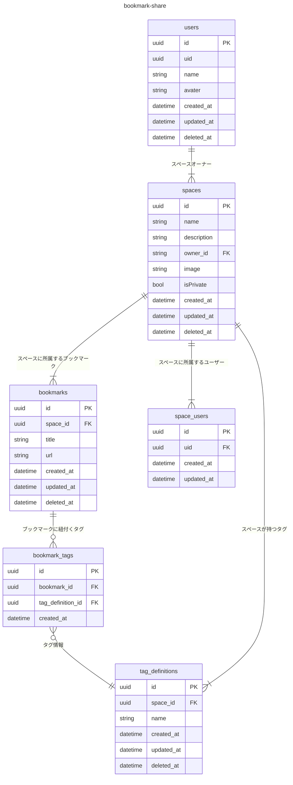

# データベース ER図

## ER図

```mermaid
---
title: bookmark-share
---
erDiagram
    spaces ||--|{ bookmarks : スペースに所属するブックマーク
    bookmark_tags }o--||tag_definitions : タグ情報
    spaces ||--|{ tag_definitions : スペースが持つタグ
    bookmarks ||--o{ bookmark_tags : ブックマークに紐付くタグ
    users ||--|{ spaces : スペースオーナー
    spaces ||--|{ space_users : スペースに所属するユーザー

    users {
        uuid id PK
        uuid uid
        string name
        string avater
        datetime created_at
        datetime updated_at
        datetime deleted_at
    }

    spaces {
        uuid id PK
        string name
        string description
        string owner_id FK
        string image
        bool isPrivate
        datetime created_at
        datetime updated_at
        datetime deleted_at
    }

    space_users {
        uuid id PK
        uuid uid FK
        datetime created_at
        datetime updated_at
    }

    bookmarks {
        uuid id PK
        uuid space_id FK
        string title
        string url
        datetime created_at
        datetime updated_at
        datetime deleted_at
    }

    bookmark_tags {
        uuid id PK
        uuid bookmark_id FK
        uuid tag_definition_id FK
        datetime created_at
    }

    tag_definitions {
        uuid id PK
        uuid space_id FK
        string name
        datetime created_at
        datetime updated_at
        datetime deleted_at
    }
```

