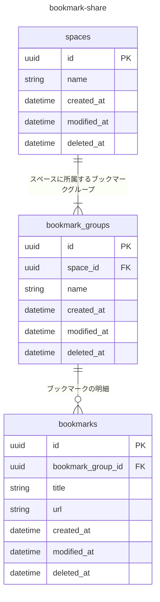

# データベース ER図

## ER図

```mermaid
---
title: bookmark-share
---
erDiagram
    spaces ||--|{ bookmark_groups : スペースに所属するブックマークグループ
    bookmark_groups ||--o{ bookmarks : ブックマークの明細

    spaces {
        uuid id PK
        string name
        datetime created_at
        datetime modified_at
        datetime deleted_at
    }

    bookmark_groups {
        uuid id PK
        uuid space_id FK
        string name
        datetime created_at
        datetime modified_at
        datetime deleted_at
    }

    bookmarks {
        uuid id PK
        uuid bookmark_group_id FK
        string title
        string url
        datetime created_at
        datetime modified_at
        datetime deleted_at
    }
```
